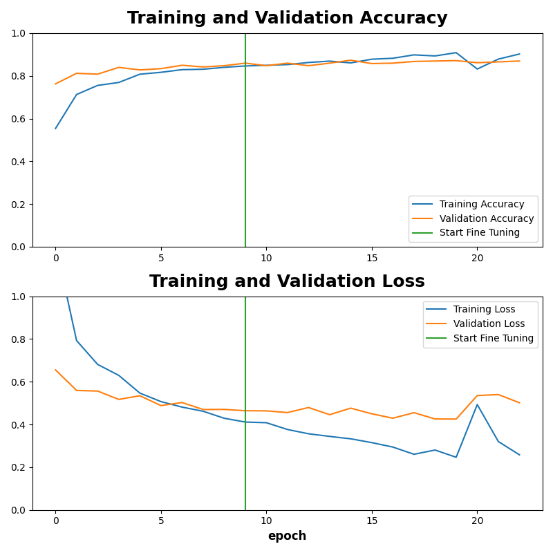

# 🖼️ Image Classification with Machine Learning

> In-depth assignment in Development — April 2026

## 📋 Table of Contents
- [About the Project](#about-the-project)
- [How It Works](#how-it-works)
- [Dataset](#dataset)
- [Model Architecture](#model-architecture)
- [Training Process](#training-process)
- [Results](#results)
- [Project Structure](#project-structure)
- [How to Run](#how-to-run)
- [Technologies Used](#technologies-used)

---

## About the Project

This project builds an **image classifier** that can identify what type of garbage is in a photo. It sorts images into 6 categories:

| Category | Description |
|---|---|
| 📦 Cardboard | Boxes, packaging |
| 🍶 Glass | Bottles, jars |
| 🔩 Metal | Cans, foil |
| 📄 Paper | Newspapers, bags |
| 🧴 Plastic | Bottles, containers |
| 🗑️ Trash | General waste |

The goal was to learn the basics of machine learning by doing — building, training, and evaluating a real model from scratch using Python and TensorFlow.

---

## How It Works

Instead of building a neural network from zero (which would require a massive dataset and a lot of time), this project uses **transfer learning**.

**Transfer learning** means we take a model that was already trained on millions of images (called **MobileNetV2**, trained on ImageNet) and adapt it to our specific problem. Think of it like hiring someone who already knows how to "see" — we just teach them what *we* need them to look for.

The process has two phases:

1. **Feature Extraction** — The base model (MobileNetV2) is frozen. Only the new top layers we added are trained. This is fast and gives a good starting point.
2. **Fine-Tuning** — We unfreeze the last 20 layers of MobileNetV2 and train everything together at a lower learning rate. This helps the model adapt more precisely to garbage images.

---

## Dataset

- **Source:** [Garbage Classification dataset on Kaggle](https://www.kaggle.com/datasets/asdasdasasdas/garbage-classification/data)
- **Classes:** 6 (cardboard, glass, metal, paper, plastic, trash)
- **Split:** 80% training / 20% validation
- **Image size:** 224 × 224 pixels (required by MobileNetV2)

The dataset is **imbalanced** — some categories have many more images than others. For example, there are 584 paper images but only 127 trash images. To handle this, **class weights** are used during training so the model pays more attention to underrepresented classes.

---

## Model Architecture

```
Input Image (224x224x3)
    ↓
MobileNetV2 (pre-trained on ImageNet) — frozen during phase 1
    ↓
GlobalAveragePooling2D
    ↓
Dense(128, activation='relu')
    ↓
Dropout(0.5)   ← reduces overfitting
    ↓
Dense(6)       ← one output per class
```

**Data augmentation** is also applied during training to make the model more robust. This randomly flips, rotates, and zooms training images so the model doesn't just memorize exact copies.

---

## Training Process

| Phase | Epochs | Learning Rate | Notes |
|---|---|---|---|
| Feature Extraction | up to 20 | 0.001 | MobileNetV2 frozen |
| Fine-Tuning | up to 10 | 0.0001 | Last 20 layers unfrozen |

**Callbacks used:**
- `EarlyStopping` — stops training if validation accuracy stops improving (patience = 3 epochs), and restores the best weights
- `ReduceLROnPlateau` — cuts the learning rate by half if the model stops improving (patience = 2 epochs)

---

## Results

The model reached approximately **87% validation accuracy** after fine-tuning.



The plot shows accuracy and loss over all training epochs. The vertical line marks where fine-tuning starts.

---

## Project Structure

```
Image-Classification-/
├── Garbage_Classification/
│   ├── train.py               # Main training script
│   ├── predict.py             # Run predictions on new images
│   ├── garbage_classifier.keras  # Saved trained model
│   └── accuracy_plot16.png    # Training history plot
├── notebooks/
│   └── fashion_MNIST/         # Early experiments with Fashion MNIST
├── Logg.md                    # Daily learning log (in Norwegian)
└── README.md                  # This file
```

---

## How to Run

### Prerequisites

This project was trained locally using a personal GPU with WSL (Windows Subsystem for Linux). TensorFlow GPU setup can vary depending on your system, so follow the official install guide to get it working on your machine:

- [TensorFlow Install Guide](https://www.tensorflow.org/install/pip)

Then install the remaining dependencies:

```bash
pip install matplotlib numpy
```

### Training the model

1. Download the [Garbage Classification dataset](https://www.kaggle.com/datasets/asdasdasasdas/garbage-classification) and place it at `Dataset/Garbage classification/`
2. Run the training script:

```bash
cd Garbage_Classification
python train.py
```

This will train the model and save it as `garbage_classifier.keras`.

### Making predictions

```bash
cd Garbage_Classification
python predict.py
```

---


## Technologies Used

| Tool | Purpose |
|---|---|
| Python 3. | Main programming language |
| TensorFlow / Keras | Building and training the neural network |
| MobileNetV2 | Pre-trained base model (transfer learning) |
| NumPy | Numerical operations |
| Matplotlib | Plotting training results |
